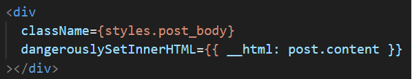
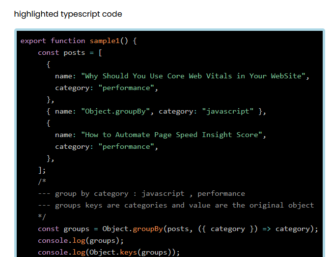

<h2>Motivation</h2>
Posts are static, so we can use local markdown files without needing a database, saving costs. But how do you create an HTML file from an .md file? That's the focus of this repo.

<h2>Installation</h2>

```bash
npm install
```

<h2>Usage</h2>

```bash
npm run dev
```

<h2>Design</h2>
<ul>
<li>Next.js is used for routing and generating static site pages (SSG) using getStaticProps and getStaticPaths</li>
<li>he .md files under /data/posts are traditional markdown files (e.g., django-crash-course.md), but some also include HTML elements (e.g., test-nath.md)</li>
<li>Each .md file contains post metadata: title, date, excerpt, cover_image, and the post content</li>
<li>Parsing the .md file and extracting its content and metadata is done using the matter function from <a href='https://www.npmjs.com/package/gray-matter'>gray-matter</a></li>
<li>The content of the .md file is converted to HTML using the parse function from <a href='https://www.npmjs.com/package/marked'>marked</a> and it is rendered in React using dangerouslySetInnerHTML</li>
<li><a href='https://www.npmjs.com/package/prismjs'>prismjs</a> is used for syntax highlighting in code blocks, with the help of <a href='https://www.npmjs.com/package/jsdom'>jsdom</a> and styles from from post.module.css</li>
</ul>

<h2>Code - server</h2>
The following logic is handled server-side, as there's no need to process it on the client.

```typescript
// Load all languages.
loadLanguages();
const post = await getPostFromDataDirectory(slug);

if (post) {
  post.content = marked.parse(post.content);
  post.content = highlightCodeInHTMLString(post.content);
}
```

<h2>Code - client</h2>
<p>The processed HTML is rendered on the client side like this:</p>



<h2>Code - highlightCodeInHTMLString</h2>
This is a function to highlight code blocks within an HTML string

```typescript
export const highlightCodeInHTMLString = (htmlString: string): string => {
  const dom = new JSDOM(htmlString);
  const codeBlocks = dom.window.document.querySelectorAll(
    "pre code"
  ) as NodeListOf<HTMLElement>;

  codeBlocks.forEach((codeBlock: HTMLElement) => {
    const language = codeBlock.className.replace("language-", "");
    const code = codeBlock.textContent!.trim();
    const highlightedCode = highlight(code, languages[language], language);
    codeBlock.innerHTML = highlightedCode;
  });

  return dom.serialize();
};
```

<h2>highlighted code - sample</h2>
Enter the post test-nath and you will see nice example as follows



<h2>Points of interest</h2>
<ul>
<li>In most .md files under /data/posts, the <a href='https://www.markdownguide.org/basic-syntax/'>markdown format</a> is used. However, HTML can also be used, as seen in test-nath.md. This is convenient because you don't need to rely solely on Markdown syntax</li>
<li><p>When creating a README.md in GitHub, you typically use the following format for code blocks</p>


With prismjs, however, the required format is slightly different:


See test-nath.md for an example.

</li> 
</ul>

<h2>Blog missing features</h2>
These features are important when you have more than 5-10 posts
<ul>
<li>Categories: To organize posts and help users find related content</li>
<li>Search: To allow users to quickly find posts by keywords</li>
</ul>

These features are not implemented in this repo, as the focus is on handling .md files, but they are essential for a full-featured blog.

<h2>References</h2>
<ul>
<li><a href = 'https://youtu.be/iVaApw3hU4c?si=64ZSkaWQQma1Klwi'> Unlock Markdown Magic with marked.js Today! </a></li>
<li><a href = 'https://youtu.be/QA09kTYLegY?si=KCgpsSqYW3zh-bbB'>  Elevate Your Code: Easy Syntax Highlighting! </a></li>
</ul>
